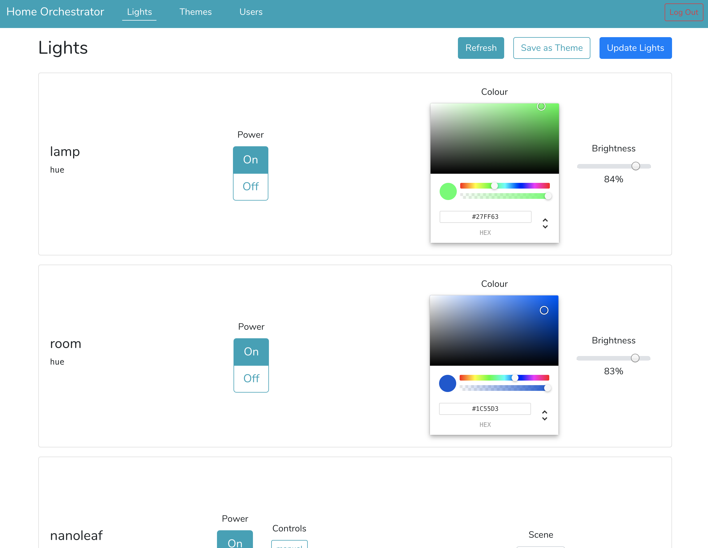

# Home Orchestrator
This is a project to manage home tasks and automation.

## Useful Links
- [https://holistic-home-5134d.web.app](https://holistic-home-5134d.web.app)
	_orchestration UI_
- [https://console.firebase.google.com/u/0/project/holistic-home-5134d/](https://console.firebase.google.com/u/0/project/holistic-home-5134d/):
	_firebase console_

## Structure
- [.project](/.project): files relating to the project, including the roadmap and known issues
- [cloud-functions](/cloud-functions): cloud functions acting as a serverless API
- [database](/database): the database for this project
- [developer-tools](/developer-tools): Scripts a developer may want to use to manage this project
- [home-api](/home-api): API control to control local devices
- [orchestration-api](/orchestration-api): API controll to orchestrate networks
- [orchestration-ui](/orchestration-ui): user interface through which one can orchestrate the home

## Guides
- To add a new light to the system, follow this guide: [/.project/guides/light_setup.md](/.project/guides/light_setup.md)